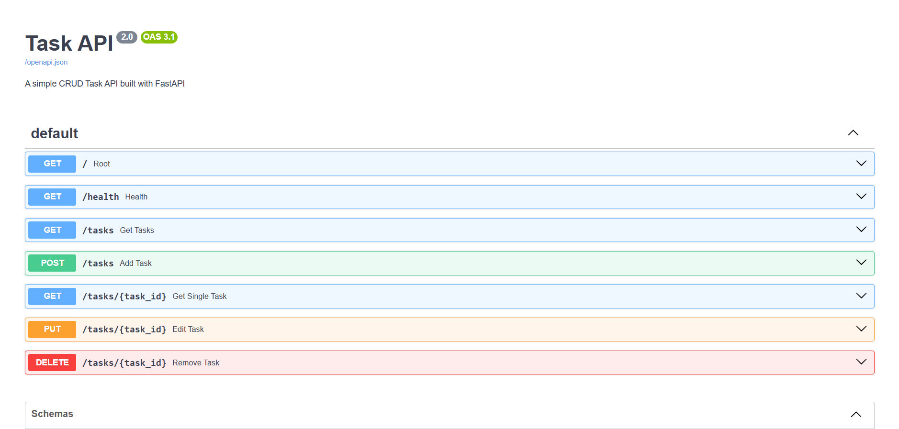

# Task API

A CRUD Task API built with FastAPI and PostgreSQL running in Docker.

## Features

- Create tasks
- Read tasks
- Update tasks
- Delete tasks
- PostgreSQL database persistence
- Dockerized application and database

---

# Architecture

Assignment 3 replaces the previous SQLite storage layer with PostgreSQL.

The API routes and service behavior remain unchanged.

The storage layer was swapped:

```
Before:

FastAPI → SQLite


After:

FastAPI → Repository → PostgreSQL
```

The API endpoints remain:

```
GET    /tasks
GET    /tasks/{id}

POST   /tasks

PUT    /tasks/{id}

DELETE /tasks/{id}
```

---

# Technologies

- FastAPI
- PostgreSQL
- SQLAlchemy
- Docker
- Docker Compose

---

# Environment Setup

Create a `.env` file based on:

```
.env.example
```

Example:

```env
DATABASE_URL=postgresql://postgres:password@db:5432/tasks
```

The `.env` file is ignored by Git because it contains configuration values.

---

# Running the Application

Start the entire stack:

```bash
docker compose up --build
```

This starts:

- FastAPI application
- PostgreSQL database

The API will be available at:

```
http://localhost:8000
```

Swagger documentation:

```
http://localhost:8000/docs
```

---

# Database

PostgreSQL stores the task data.

The database table is automatically created using:

```
schema.sql
```

The table contains:

| Column | Type |
|---|---|
| id | Integer |
| title | Text |
| done | Boolean |

---

# Persistence Test

Persistence was verified using the following steps:

1. Started the application:

```bash
docker compose up
```

2. Created tasks using:

```
POST /tasks
```

3. Stopped the containers:

```bash
docker compose down
```

4. Started them again:

```bash
docker compose up
```

5. Confirmed the tasks were still available:

```
GET /tasks
```

The data remained because PostgreSQL uses a Docker volume:

```
postgres_data
```

---

# Database Screenshot

Below is a screenshot of the PostgreSQL database.


